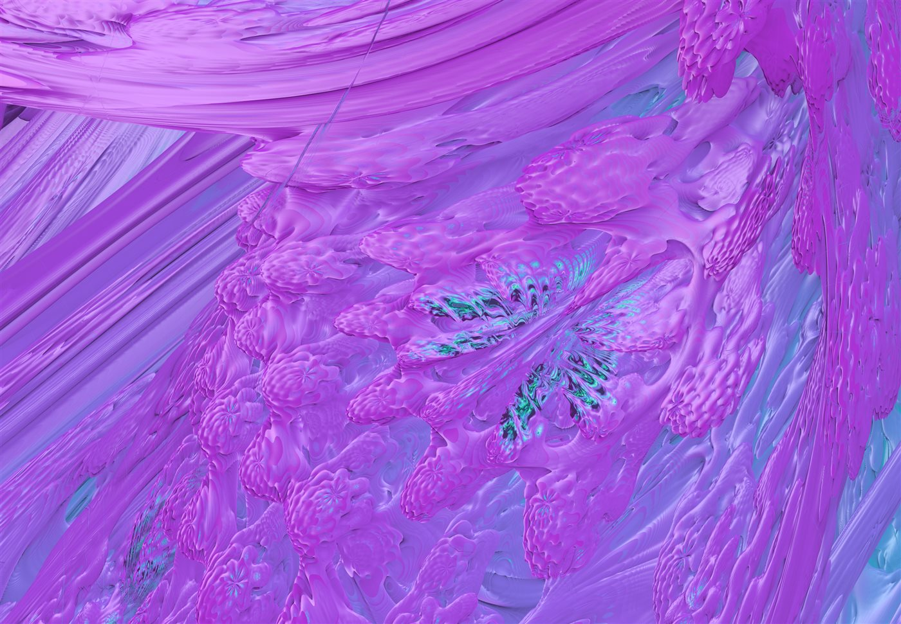
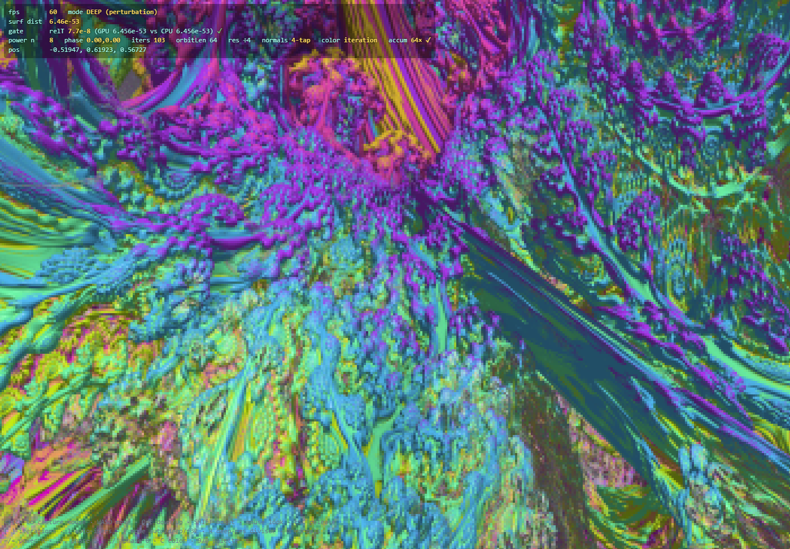

# Mandelbulb Perturbation Deep-Zoom

[](images/orbit-trap-2e-32.png)

Real-time fly-navigation of the **3D Mandelbulb** to ~**1e-50** surface distance on a consumer GPU,
in the browser, via **3D perturbation theory** — and flyable past that toward the precision wall
(~1e-77). A literature sweep (June 2026) found no published derivation, code, or demonstration of
Mandelbulb perturbation deep-zoom; prior renderers wall at ~1e-6 (f32) / ~1e-13 (f64). Every depth
milestone here is **certified against an independent arbitrary-precision referee** that shares no
code or math with the renderer.

The whole thing is a single self-contained `index.html` — no build, no dependencies, loads nothing
external. Open it in a desktop browser with a decent GPU (Chrome/Edge/Firefox, WebGL2).

> **Honest framing.** "No published demonstration found," not "world first." 1e-50 was an arbitrary
> target — there is no degradation there; the real wall is the BigInt reference precision
> (P=256 ≈ 1e-77). Below the certified depth, "looks right" outruns "proven right": the near-critical
> f32 chain is orbit-conditioned, so deep images are real Mandelbulb geometry within the kernel's own
> arithmetic, but treat sub-1e-50 as beautiful exploration rather than certified.

---

## Gallery

The banner above is orbit-trap colouring at depth **2e-32**, a 2560×1776 in-app export
([full resolution](images/orbit-trap-2e-32.png)).



Iteration colouring at **6.4e-53** — flown live; the HUD shows the surface distance and settings. (All
imagery is generated by this renderer.)

---

## Run it

Just open `index.html` in a desktop browser, or serve the folder:

```bash
python -m http.server      # then visit http://localhost:8000/index.html
```

First load compiles a heavy GLSL shader (~15 s, shown by a spinner; the f32 baseline animates
meanwhile). Your GPU driver caches it, so refreshes are instant.

## Fly it

Click the canvas to capture the mouse.

| Key | Action |
|-----|--------|
| **W A S D** / **Q E** | move / down-up · **Shift** boost · mouse look · **Esc** release |
| **[** **]** | iterations −/+ · **I** auto-iterations (scale with depth) |
| **P** | mode: auto / deep / f32 · **R** deep-mode resolution divisor |
| **N** | normals: screen-space / 3-tap / 4-tap |
| **−** **=** | Mandelbulb power *n* (integer 2–16) |
| **,** **.** | phase φ · **;** **'** phase θ (lobe twist) |
| **C** | colour: plain / iteration / orbit-trap · **9** **0** palette frequency |
| **F** **G** | surface detail (how close rays reach the surface) |
| **L** | lighting: directional / camera headlamp / both · **T** **Y** headlamp falloff |
| **V** | live ground-truth gate on/off |
| **X** | export a hi-res PNG of the current view |
| **M** | record / stop+save a camera path |
| **?** | About / Credits |

The HUD's `gate` line is the live ground-truth check (GPU vs an independent CPU referee at the view
centre): green ✓ = you're in the trustworthy domain. Speed auto-crawls as you approach the surface.

## Stills, paths & video (console API)

Open the dev console for the full pipeline. All renders are **tiled** (TDR-safe at any depth) and
**jitter-accumulated** (denoise + anti-alias); call `__cancelRender()` (or press **Esc**) to abort.

```js
// ── hi-res still (downloads a PNG) ──────────────────────────────────────────
__export(longEdge = 2560, samples = 16, tile = 128)   // also bound to key X

// ── camera paths ────────────────────────────────────────────────────────────
// Key M records a flight and downloads it as JSON. The camera is stored as
// P=256 BigInt strings, so paths are precise at ANY depth.
__playPath(data)              // replay a path object in real time
__loadPathFile()              // file-picker → replay
__lastPath()                  // the path object from the last recording

// ── render a path to a video frame sequence (downloads ONE .zip of PNGs) ─────
__renderPath(data, {
  frames,        // total output frames, resampled evenly over the flight
                 //   (use this so a long recording doesn't become 3000 frames)
  fps     = 30,  // playback fps label (used if `frames` is omitted: frames = fps × duration)
  longEdge = 1280,
  samples = 8,   // jittered passes per frame
  tile    = 128
})
__renderPathFile(opts)        // file-picker → render to a .zip

// abort any export / path render
__cancelRender()
```

### Examples

```js
// A quick 4K still of whatever you're looking at right now:
__export(3840, 24)

// Record a flight (press M to start/stop), then turn it into a 6-second 1080p
// clip at 30 fps — that's 180 frames, no matter how long you took recording:
__renderPath(__lastPath(), { frames: 180, longEdge: 1920, samples: 12 })

// Fast draft of the same flight (low res, few samples) to check the motion:
__renderPath(__lastPath(), { frames: 60, longEdge: 640, samples: 4 })

// Render a path you saved earlier (opens a file picker), at high quality:
__renderPathFile({ frames: 300, longEdge: 2560, samples: 24 })

// Just preview a saved flight in real time, no rendering:
__loadPathFile()

// Bail out of a render in progress (or press Esc):
__cancelRender()
```

Then turn the unzipped frames into a video with [ffmpeg](https://ffmpeg.org):

```bash
ffmpeg -framerate 30 -i frame_%05d.png -c:v libx264 -pix_fmt yuv420p flight.mp4
```

**Tip:** choose `frames` for the clip length you want (`seconds × fps`) and pass the same `fps` to
ffmpeg. The flight is resampled evenly across however long you actually recorded, so a leisurely
40-second exploration and a frantic 5-second one both become exactly the number of frames you ask for
— `frames` is what stops a long recording becoming thousands of images. `samples` is quality per frame
(8 is fine for motion; 16–24 for a final); `longEdge` is the long side in pixels.

A path stores the **camera trajectory and geometry** (power / phase / iterations) only — the **look**
(colour, lighting, surface detail) is whatever you have set live. So you can record a flight once and
re-render it with different colour palettes or lighting, and an export/render always matches the look
on screen. Renders also **preview on the canvas as they build**, tile by tile.

Recordings are **smoothed for cinematic playback**: hand-jitter is low-passed off the keyframes on
save, and playback/render interpolate the camera with a **Catmull-Rom spline** (velocity-continuous,
exact at any depth via BigInt) instead of straight segments — so motion flows through the keyframes
rather than stuttering at each one. (`__smoothPath(data, passes, alpha)` to re-smooth a loaded path;
`__samplePath(data, t)` to scrub one.)

(Other live setters: `__setPower(n)`, `__setPhase(θ,φ)`, `__setColor(mode,scale)`,
`__setLight(mode,falloffMul)`, `__setSurf(mul)`, `__setGate(bool)`.)

## Verify it

The point of "certified" is that you can re-run the certification. The suites drive the **real GPU**
through headless Chrome (Playwright) and compare the renderer against referees that share no math
with the kernel.

```bash
npm install
npm run verify        # direct-check (11/11, non-circular BigInt) + harness-dive (7/7) + gpu-kernel
node power-cert.mjs   # integer power n + phase, vs the BigInt referee
node bla.test.mjs     # CPU BLA skip-table reference (no GPU)
```

- **`direct-check.test.mjs`** — the headline gate: GPU perturbed distance-estimate vs an independent
  **BigInt fixed-point direct march** of the explicit pixel point (zero shared code/math), 11/11 from
  1e-5 to 1e-50, escape flags agreeing.
- **`harness-dive.test.mjs`** — scripted depth milestones 1e-6 → 1e-50, GPU vs an independent f64
  perturbed referee.
- **`gpu-kernel.test.mjs`** — the kernel arithmetic core vs arbitrary-precision oracles, on
  d3d11 / gl / vulkan.
- **`power-cert.mjs`** — certifies non-default integer powers and phase, non-circularly.
- The remaining `*.test.mjs` are the CPU math-validation suites (the §3 derivation, the perturbed
  distance estimator, escape/bailout, axis/pole glitch, the high-precision reference orbit).

Requires a desktop NVIDIA/AMD-class GPU; the harness launches headed Chrome via ANGLE. ⚠ Full-res
deep frames trip the Windows GPU watchdog — the suites stay at safe resolution divisors.

## How it works (short version)

Perturbation theory tracks one **high-precision reference orbit** plus per-pixel **deltas** in low
precision. 2D Mandelbrot is easy because `z²` gives an *exact finite* delta (`2Zδ+δ²`). The triplex
power is **non-analytic** (`rⁿ`, `acos`, `atan2`, trig of `nθ`), so its delta is an infinite series
with catastrophic cancellation. The core result here ([`docs/triplex-perturbation-math.md`](docs/triplex-perturbation-math.md))
is an **exact, cancellation-free** delta recurrence for it (the residual forms of Δr, Δθ, Δφ), plus a
perturbed distance-estimator (Δr/Δdr).

On the GPU side: in-shader double-single arithmetic is dead on NVIDIA (error-free transforms
collapse), so deltas are carried in **HDR** (f32 mantissa + integer exponent). The reference orbit and
camera are **BigInt fixed-point** (P=256, ~77 digits), transcendental-free via Chebyshev multiple-angle
polynomials, rebuilt at the camera each move. Rebasing follows Zhuoran's condition with a Δdr
re-anchor. The renderer marches an HDR-`t` ray, bisects onto the n-iteration boundary, denoises by
temporal jitter accumulation when idle, and exports at arbitrary resolution by tiling.

## Credits

Standing on the shoulders of: **Daniel White & Paul Nylander** and the fractalforums community (the
Mandelbulb, 2009); **K. I. Martin** (*SuperFractalThing*, perturbation theory, 2013); **John C. Hart**
(sphere tracing) with Mandelbulb-DE practice popularized by **Inigo Quilez** and **Mikael Hvidtfeldt
Christensen** (Syntopia); **Zhuoran** (rebasing & BLA) developed further in **Claude Heiland-Allen**'s
Fraktaler-3 and the wider deep-zoom community (FractalShark, Imagina, FractalShades; mathr.co.uk);
**Pauldelbrot** (glitch detection). 2D deep-zoom architecture, HDR helpers, and fly-slowdown ported
from [GMT](https://gmt-fractals.com).

Project lead **Gigh Zack** (GMT) — posed the problem, set the target, flew every acceptance flight,
and diagnosed by eye three renderer defects the automated suites had missed. Feature direction from
**Lycium** (Maxon): local camera lighting and camera-path export. Built with **Claude Code**
(Anthropic) — Claude Opus 4.x and Claude Fable 5. See the in-app **About / Credits** panel (key `?`)
for the full note.

**What is new here, to our knowledge:** an exact cancellation-free perturbation recurrence for the
non-analytic triplex power; a perturbed distance-estimator delta valid to 1e-50; BLA skip tables
generalized to a 3D non-analytic map; and the certified-depth methodology (every claim backed by a
referee sharing zero math with the kernel).

## License

[GPL-3.0](LICENSE), in the spirit of the fractal community whose shoulders this stands on.
